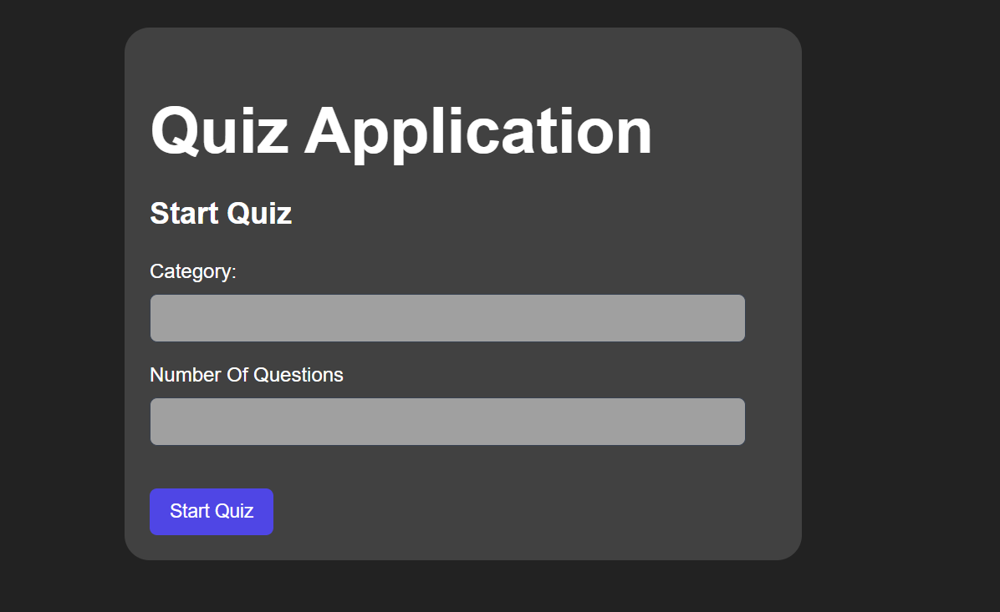
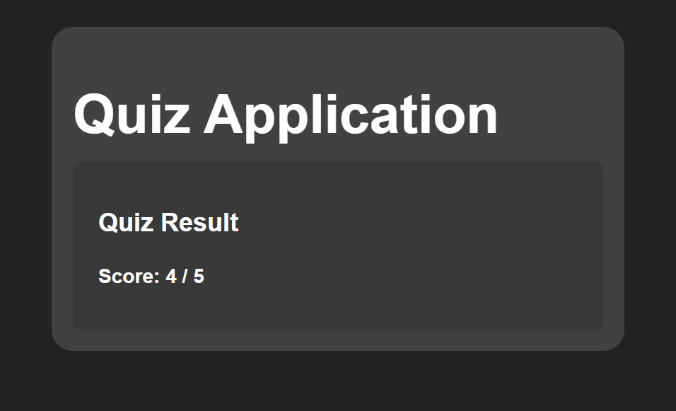

# 🧠 Full-Stack Quiz Application

A production-ready **full-stack Quiz Application** built using **Spring Boot**, **React**, and **PostgreSQL**.  
Users can dynamically generate quizzes by category, answer questions one at a time, and receive accurate scores based on validated responses.

This project prioritizes **clean architecture**, **concept-based learning**, and **end-to-end correctness** over UI gimmicks.

---

## 🚀 Key Features

- Dynamic quiz creation by category (Java / Python)
- Randomized question selection from database
- One-question-at-a-time flow (focused UX)
- Answer selection validation (cannot skip)
- Accurate backend score evaluation
- Clean REST APIs with proper layering
- CORS configured correctly
- Secure configuration using environment variables

---

## 📸 Application Screenshots

### 🏠 Home – Start Quiz

### ❓ Quiz – Answer Questions

### 🏁 Result – Final Score

## 🏗️ Tech Stack

### Backend
- Java 17
- Spring Boot
- Spring Data JPA
- PostgreSQL
- Maven

### Frontend
- React (Vite)
- React Router DOM
- Axios
- Custom CSS (minimal, clean)

---

## 📂 Project Structure

